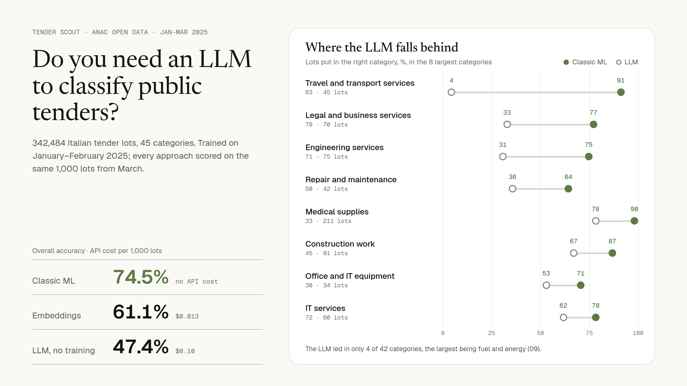

# Tender Scout

Do you need an LLM to classify Italian public tenders? This project compares a classic model, embeddings and a
zero-shot LLM on Amazon Bedrock, on the same data, by accuracy and by cost.



Companies that bid on public tenders need to send each new tender to the right team. Here every lot published
on ANAC's open data is classified into its CPV division (45 classes, e.g. 33 = medical equipment,
45 = construction work), and three approaches are scored on macro-F1 and on cost per 1,000 lots:

| Approach | What it is |
|---|---|
| Classic ML | TF-IDF (word + character n-grams) and a linear SVM, trained locally |
| Embeddings | Amazon Titan Text Embeddings v2 on Bedrock, plus logistic regression |
| Zero-shot LLM | A Bedrock model (e.g. Amazon Nova Lite) reads the lot and answers with the code |

## Results

Classic model, trained on Jan + Feb 2025 (224,710 lots), tested once on March (117,774 lots, 45 classes):

| Model | Macro-F1 | Accuracy |
|---|---|---|
| Majority class (always 33, medical) | 0.009 | 0.242 |
| TF-IDF + linear SVM (C = 0.3, tuned on Feb) | **0.574** | **0.774** |
| same, only test lots whose text never appeared in training (113,381) | 0.565 | 0.770 |

Training takes about 3 minutes on 4 CPUs; prediction about 0.25 ms per lot. The most frequent errors are
between divisions that genuinely overlap: repair and maintenance (50) vs construction work (45), software
(48) vs IT services (72), energy (09) vs utilities (65), business services (79) vs engineering (71).
Details: `reports/baseline_metrics.json`, `baseline_per_class.csv`, `baseline_confusions.csv`.

### Classic ML vs embeddings vs LLM

All methods scored on the same fixed sample of 1,000 March lots (`reports/comparison.md`):

| Approach | Macro-F1 | Accuracy | USD per 1,000 lots |
|---|---|---|---|
| TF-IDF + linear SVM, trained on 224,710 lots | **0.510** | **0.745** | ~0 (no API cost) |
| TF-IDF + linear SVM, trained on the same 20,000 lots as the embeddings | 0.417 | 0.693 | ~0 |
| Titan Text Embeddings v2 (512 dimensions) + logistic regression, 20,000 training lots | 0.339 | 0.611 | 0.013 |
| Zero-shot LLM, Amazon Nova Lite (`eu.amazon.nova-lite-v1:0`) | 0.269 | 0.474 | 0.10 |
| Majority class (full test set) | 0.009 | 0.242 | 0 |

Costs are on-demand prices for eu-central-1 from the AWS Price List API (29 Sep 2026): Nova Lite
$0.000078 / $0.000312 per 1,000 input / output tokens, Titan Text Embeddings v2 $0.0002 per 1,000 tokens.
Embedding the 20,000 training lots was a one-off 1.25 M tokens (about $0.25).

What I found:

- The classic model is the most accurate and the cheapest. For this task an LLM isn't needed.
- It isn't only a matter of training data. On the same 20,000 lots, TF-IDF still beats the embeddings
  (0.417 vs 0.339 macro-F1). Lot titles are short and formulaic, so exact words and character n-grams carry
  more signal than general-purpose sentence vectors.
- The LLM's errors are about coding conventions, not language. It only sees the 45 division names. Design and
  works-supervision contracts for a building project are coded 71 (engineering services); the LLM says 45
  (construction work). School trips (*viaggio di istruzione*) are coded 63 (travel-agency services); it says 80
  (education) or 92 (recreation). A town's legal defence is coded 79 (legal services); it says 75 (public
  administration). Out of 1,000 lots, it was right on 35 that the classic model got wrong, and wrong on 306
  that the classic model got right.
- Most of the LLM's cost is the prompt: about 1,286 input tokens per lot, nearly all of them the list of
  divisions, for a two-digit answer.

## Data

- Source: ANAC, *Banca dati nazionale dei contratti pubblici*, dataset `cig-2025`, monthly CSV
  ([dati.anticorruzione.it](https://dati.anticorruzione.it/opendata/dataset/cig-2025)), licence CC BY-SA 4.0.
- One row per lot (CIG); 61 columns, `;`-separated.
- Used: January–March 2025, i.e. 349,306 raw rows → 344,284 lots → **342,484 labelled lots in 45 CPV divisions**.

## Data decisions (each checked on the real files)

| Finding | Decision |
|---|---|
| The ANAC portal's API sits behind a firewall that answers HTTP 200 with an HTML "Request Rejected" page | Download the monthly zips directly; accept a file only if it is a complete zip (CRC test), never on the status code alone |
| Long downloads were cut off at ~70% | Retry until the zip validates (`download.py`) |
| 5,021 extra rows: 3,465 lots list several CPV codes; 1,079 of them in *different* divisions (up to 6) | Keep only the prevalent CPV (`flag_prevalente = 1`), ANAC's own definition of the main object |
| 1 lot has no prevalent CPV | Dropped and logged (`reports/cleaning_log.json`) |
| 36,111 prevalent codes are written without the check digit (`85312320`) and without a description | Accept both formats; a strict pattern would silently drop 10% of the data |
| 1,800 lots have code `99999999`, "Cpv prevalente non disponibile" | No label: excluded from training and scoring (a natural target for the model later) |
| Label `cod_cpv` = `45112000-5` (last digit is a check digit) | Target = first 2 digits (division); codes read as text so `09` keeps its zero |
| `descrizione_cpv` is the label in words; outcome columns (`ESITO`, award dates) are known only months later | Never used as inputs (leakage) |
| A tender can have many lots sharing one title (`oggetto_gara`) | Input text = `oggetto_lotto`, plus `oggetto_gara` when different |
| 322,538 tenders; only 1 spans more than one month | Split by month: train = Jan, validation = Feb, test = Mar. Lots of one tender never straddle train and test |
| One class holds 23% of lots (33, medical) | Report macro-F1, not just accuracy, next to a majority-class baseline |
| ~13% of rows repeat an earlier text with the same label (recurring purchases) | Also report the score on test lots whose text never appeared in training |
| Median lot text is 66 characters | Cheap for LLMs per call; well suited to character n-grams |

## Run it

```bash
python3 -m venv .venv && source .venv/bin/activate
pip install -e ".[aws,dev]"

python -m tender_scout.download --year 2025 --months 01 02 03   # ~65 MB of zips, skips files you have
python -m tender_scout.prepare                                   # data/interim/lots.parquet + reports/
python -m tender_scout.baseline                                  # tunes C on Feb, tests on Mar
python -m tender_scout.bedrock_llm --limit 20                    # cheap trial on Bedrock
python -m tender_scout.bedrock_llm                               # 1,000 lots
python -m tender_scout.bedrock_embed --n-train 20000
python -m tender_scout.compare                                   # reports/comparison.md
pytest && ruff check .
```

Bedrock needs AWS credentials (`aws login`), region `eu-central-1`, and access to the models in the
Bedrock console. New accounts have low on-demand quotas: calls back off when throttled, and an
interrupted run resumes from the cache (`--workers 2` keeps Nova Lite under a new account's limit). For costs, copy `prices.example.json` to `prices.json` and fill in current prices from
the [Bedrock pricing page](https://aws.amazon.com/bedrock/pricing/); without it, reports show token counts only.
All Bedrock answers are cached in `data/interim/`, so re-running never pays twice.

## Layout

```
tender_scout/
  download.py       validated monthly downloads
  prepare.py        cleaning, labels, time split, fixed evaluation sample
  baseline.py       TF-IDF + linear SVM, majority baseline, tuning
  bedrock_embed.py  Titan embeddings + logistic regression
  bedrock_llm.py    zero-shot classification via the Converse API
  evaluate.py       shared metrics (macro-F1, unseen-text subset, confusions)
  compare.py        one table for all methods
tests/              synthetic ANAC-shaped data reproducing the real quirks
```

## Roadmap

- MLOps on AWS: SAM template, monthly retraining on EventBridge as new ANAC months appear, model
  and metrics in S3, CloudWatch alarm when macro-F1 drops, GitHub Actions for tests and deploy.
- Error analysis of the confusions between neighbouring divisions (e.g. 45 works vs 71 engineering services).

## Licence

Code: MIT (`LICENSE`). Data and the derived files in `reports/`: ANAC open data, CC BY-SA 4.0.

## How this was built

This is my project. I picked the problem and explored the ANAC files hands-on in a notebook, and most of the
data decisions above come from what I found there: the firewall and the broken downloads, lots with several CPV
codes, tenders that stay within one month, the dominant medical category and the repeated titles. The Bedrock
runs use my own AWS account, and the pipeline, tests and CI make every number in this README reproducible.
